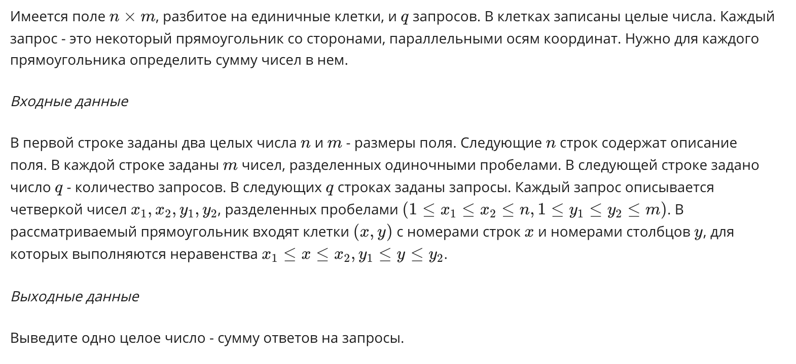

# Прямоугольник

## Пример входных данных
    5 6
    1 3 7 -1 7 11
    2 6 5 1 1 3
    -3 0 2 0 3 8
    5 1 3 1 4 7
    6 1 -2 2 1 0
    3
    2 3 2 3
    1 1 5 6
    3 5 3 6

## Пример выходных данных
    60

Ответы на запросы для примера: 13, 18 и 29.
Введите ответ для теста из файла rectangle.in.