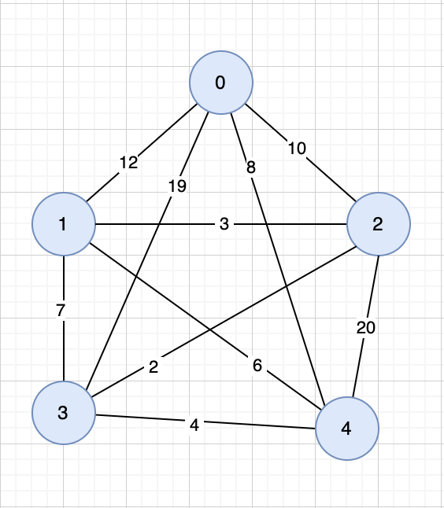

# Коммивояжер динамика 5 узлов

## 0 Пустых вершин из 0
    Cost(0, {}, 1) = 12
    Cost(0, {}, 2) = 10
    Cost(0, {}, 3) = 19
    Cost(0, {}, 4) = 8

    4 операции
## Через 1
### Варианты:
    {1} - {2, 3, 4}
    {2} - {1, 3, 4}
    {3} - {1, 2, 4}
    {4} - {1, 2, 3}

	Cost(0, {1}, 2) = Cost(0, {}, 1) + d[1, 2] = 12 + 3 = 15
	Cost(0, {1}, 3) = Cost(0, {}, 1) + d[1, 3] = 12 + 7 = 19
	Cost(0, {1}, 4) = Cost(0, {}, 1) + d[1, 4] = 12 + 6 = 18

	Cost(0, {2}, 1) = Cost(0, {}, 2) + d[2, 1] = 10 + 3 = 13
	Cost(0, {2}, 3) = Cost(0, {}, 2) + d[2, 3] = 10 + 2 = 12
	Cost(0, {2}, 4) = Cost(0, {}, 2) + d[2, 4] = 10 +20 = 30

	Cost(0, {3}, 1) = Cost(0, {}, 3) + d[3, 1] = 19 + 7 = 26
	Cost(0, {3}, 2) = Cost(0, {}, 3) + d[3, 2] = 19 + 2 = 21
	Cost(0, {3}, 4) = Cost(0, {}, 3) + d[3, 4] = 19 + 4 = 23

	Cost(0, {4}, 1) = Cost(0, {}, 4) + d[4, 1] = 8 + 6 = 14
	Cost(0, {4}, 2) = Cost(0, {}, 4) + d[4, 2] = 8 + 20 = 28
	Cost(0, {4}, 3) = Cost(0, {}, 4) + d[4, 3] = 8 + 4 = 12

    4х3 = 12 операций
## Через 2
### Варианты:
    {1, 2} - {3, 4}
    {1, 3} - {2, 4}
    {1, 4} - {2, 3}
    {2, 3} - {1, 4}
    {2, 4} - {1, 3}
    {3, 4} - {1, 2}

	Cost(0, {1, 2}, 3) = 17 = min(
        Cost(0, {1}, 2) + d[2, 3] = 15 + 2 = 17
        Cost(0, {2}, 1) + d[1, 3] = 13 + 7 = 20
    )
	Cost(0, {1, 2}, 4) = 19 = min (
        Cost(0, {1}, 2) + d[2, 4] = 15 + 20 = 35
        Cost(0, {2}, 1) + d[1, 4] = 13 + 6 = 19
    )

	Cost(0, {1, 3}, 2) = x
	Cost(0, {1, 3}, 4) = x
	
	Cost(0, {1, 4}, 2) = x
	Cost(0, {1, 4}, 3) = x
	
	Cost(0, {2, 3}, 1) = x
	Cost(0, {2, 3}, 4) = x
	
	Cost(0, {2, 4}, 1) = x
	Cost(0, {2, 4}, 3) = x

	Cost(0, {3, 4}, 1) = x
	Cost(0, {3, 4}, 2) = x

    6х2 = 12 операций
## Через 3
### Варианты:
    {1, 2, 3} - {4}
    {1, 2, 4} - {3}
    {1, 3, 4} - {2}
    {2, 3, 4} - {1}

    Cost(0, {1, 2, 3}, 4) = min(
            Cost(0, {1, 2}, 3) + d[3, 4]
            Cost(0, {1, 3}, 2) + d[2, 4]
            Cost(0, {2, 3}, 1) + d[1, 4]
        )
    Cost(0, {1, 2, 4}, 3) = min(
            Cost(0, {1, 2}, 4) + d[4, 3]
            Cost(0, {1, 4}, 2) + d[2, 3]
            Cost(0, {2, 4}, 1) + d[1, 3]
        )
    Cost(0, {1, 3, 4}, 2) = min(
            Cost(0, {1, 3}, 4) + d[4, 2]
            Cost(0, {1, 4}, 3) + d[3, 2]
            Cost(0, {3, 4}, 1) + d[1, 2]
        )
    Cost(0, {2, 3, 4}, 1) = min(
            Cost(0, {2, 3}, 4) + d[4, 1]
            Cost(0, {2, 4}, 3) + d[3, 1]
            Cost(0, {3, 4}, 2) + d[2, 1]
        )

    4 операции
## Через 4
### Варианты:
    {1, 2, 3, 4} - {}

    Cost(0, {1, 2, 3, 4}, 0) = min(
            Cost(0, {1, 2, 3}, 4) + d[4, 0]
            Cost(0, {1, 2, 4}, 3) + d[3, 0]
            Cost(0, {1, 3, 4}, 2) + d[2, 0]
            Cost(0, {2, 3, 4}, 1) + d[1, 0]
        )

    1 операция

4 + 12 + 12 + 4 + 1 = 33